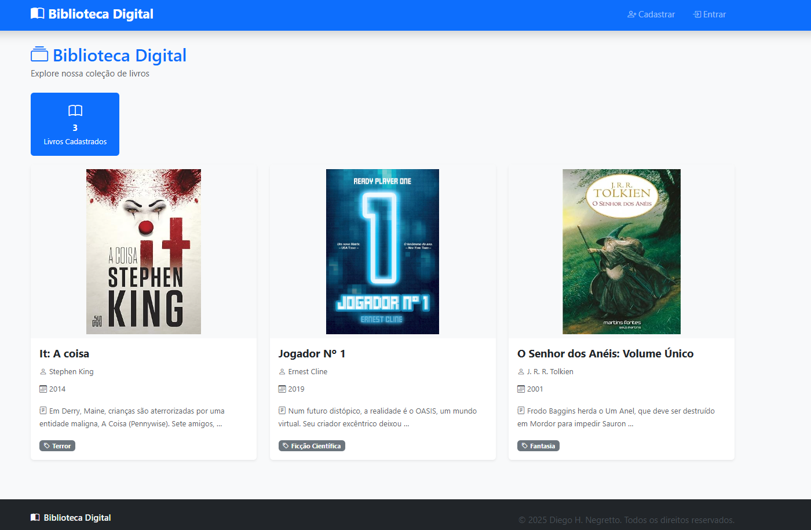
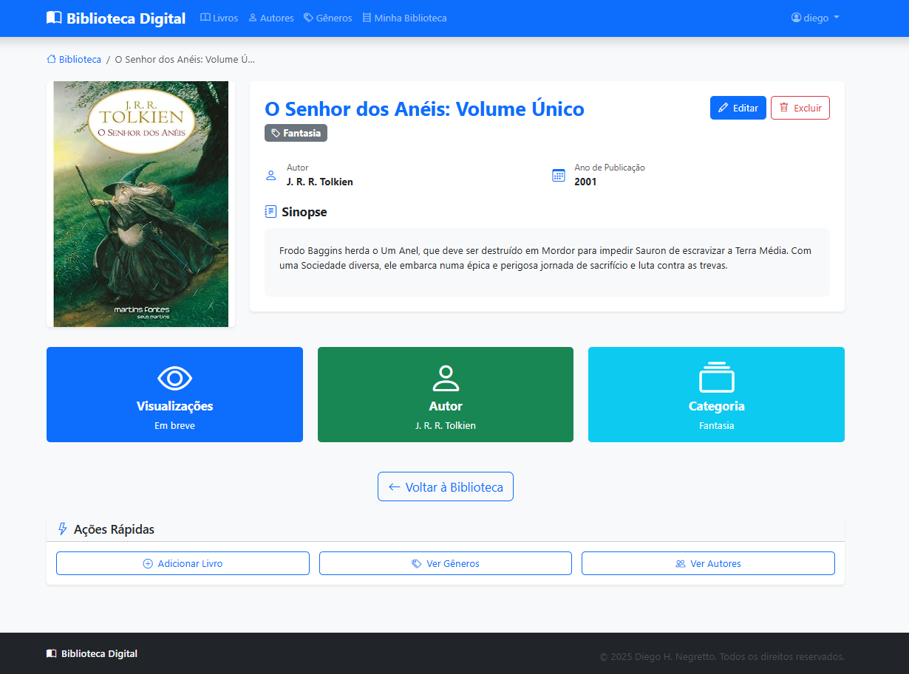
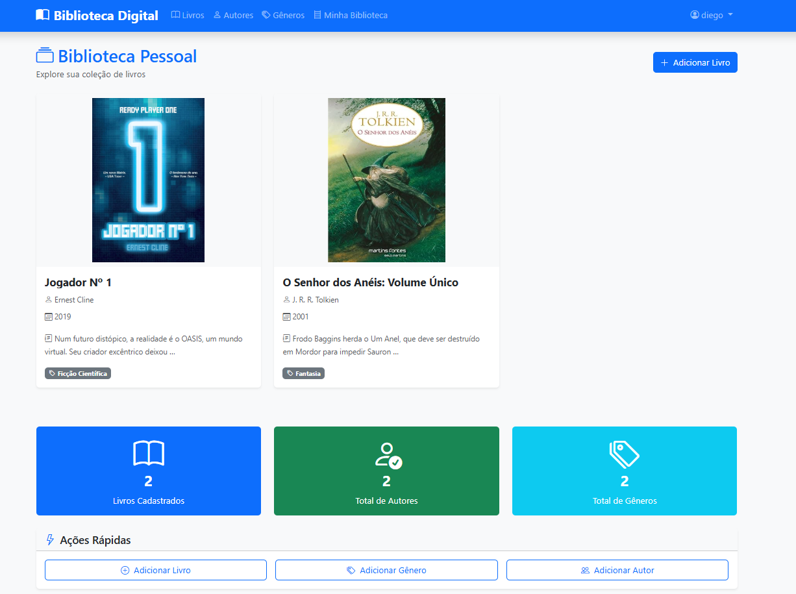
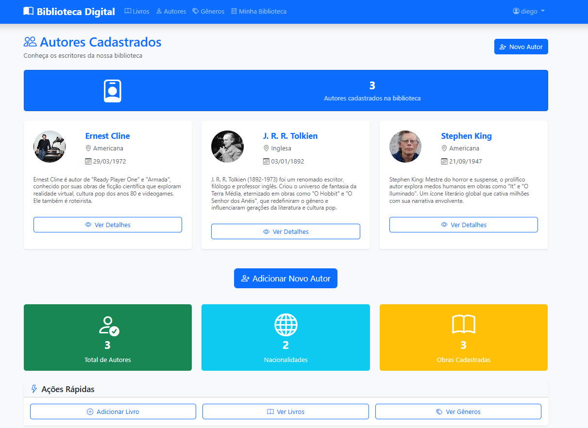
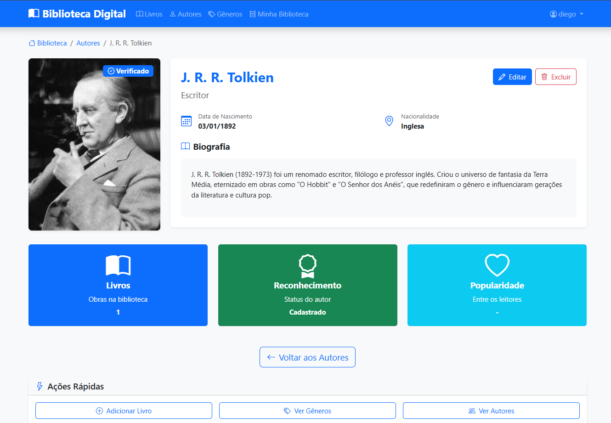

# 📚 Library App

O **Library App** é um sistema de **biblioteca digital** desenvolvido em **Django** que permite a consulta, o cadastro e a gestão de livros, autores e gêneros literários.  
Usuários deslogados podem apenas consultar os livros disponíveis, enquanto usuários autenticados têm acesso a funcionalidades completas de cadastro, edição e exclusão.

---

## 🚀 Funcionalidades Principais

- 🔍 **Consulta pública** de livros cadastrados (acesso livre, sem login).  
- 👤 **Cadastro de usuários** com possibilidade de edição de perfil e exclusão da conta.  
- ✏️ **Usuários autenticados** podem cadastrar, editar e excluir:
  - Gêneros literários  
  - Autores  
  - Livros  
- 📖 **Biblioteca particular** — cada usuário pode visualizar os livros que ele mesmo cadastrou.  
- 🤖 **Integração com Gemini API**:
  - Gera **sinopse automática** se o usuário não informar uma.  
  - Gera **descrição de gênero** automaticamente.  
  - Gera **biografia de autor** automaticamente.  

---

## 🧱 Estrutura do Projeto

```
Library/
├── accounts/         # Gerenciamento de usuários e perfis
├── app/              # Configurações principais do projeto Django
├── authors/          # Módulo de cadastro e listagem de autores
├── books/            # Módulo principal de gerenciamento de livros
├── genres/           # Módulo de cadastro e listagem de gêneros
├── gemini_api/       # Integração com a API do Gemini para geração de textos
├── media/            # Arquivos de mídia enviados pelos usuários
├── static/           # Arquivos estáticos (CSS, JS, imagens)
├── screenshots/      # Imagens utilizadas no README
├── manage.py
├── requirements.txt
├── .env.example
└── db.sqlite3
```

---

## 🧠 Tecnologias Utilizadas

- **Python 3**
- **Django**
- **SQLite**
- **Gemini API (Google AI)**
- **Bootstrap**
- **JavaScript**
- **Django Template Language**

> 💡 O front-end foi gerado com auxílio de **IA** e aprimorado manualmente.

---

## ⚙️ Como Executar o Projeto

### 1️⃣ Clonar o repositório
```bash
git clone https://github.com/diegonegretto/library-app.git
cd library-app
```

### 2️⃣ Criar e ativar um ambiente virtual
```bash
python -m venv venv
# Windows
venv\Scripts\activate
# Linux/Mac
source venv/bin/activate
```

### 3️⃣ Instalar as dependências
```bash
pip install -r requirements.txt
```

### 4️⃣ Configuração da chave da API 🔑 
Crie um arquivo `.env` com base no `.env.example` e adicione suas chaves de API do Gemini e configurações locais. Caso nenhuma chave API for informada, o sistema funcionará normalmente sem as gerações automáticas feitas pela IA.

Crie um arquivo `.env` na raiz do projeto baseado no modelo
`.env.example`:

``` bash
cp .env.example .env
```

Abra o `.env` e insira sua chave da API:

``` env
API_KEY=sua_chave_aqui
```

### 5️⃣ Executar as migrações
```bash
python manage.py migrate
```

### 6️⃣ Rodar o servidor
```bash
python manage.py runserver
```

Acesse o sistema em:  
👉 [http://localhost:8000/books](http://localhost:8000/books)

---

## 🖼️ Demonstração

Abaixo, alguns exemplos das principais telas do sistema:

### Página inicial


### Detalhes do livro


### Biblioteca do usuário


### Lista de Autores


### Detalhes do autor



> 💬 As imagens acima estão localizadas na pasta `screenshots/` do projeto.

---

## 👤 Autor

**Diego Negretto**  
📎 [GitHub](https://github.com/diegonegretto)

---

## 📜 Licença

Este projeto não possui licença específica.  
Sinta-se à vontade para estudar e adaptar o código para fins educacionais.

---

## 💬 Contato

Caso tenha dúvidas ou sugestões de melhoria, entre em contato via **GitHub Issues**.
